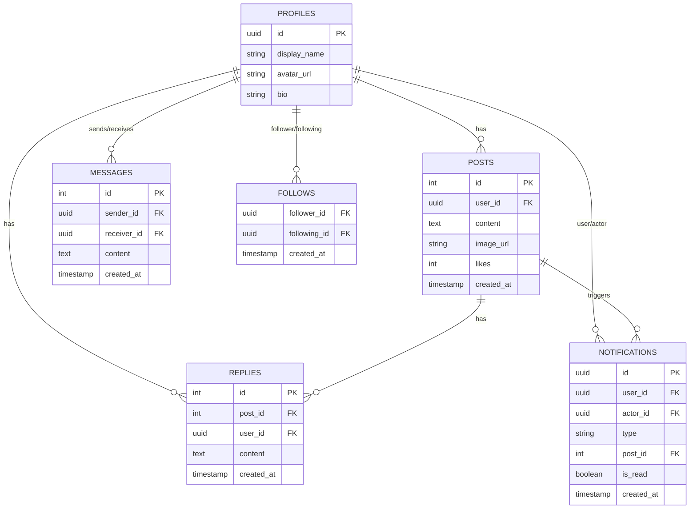

# 学習記録 スレッド掲示板 v2 (Learning Log SNS Platform)

Next.js と Supabase を活用して構築された、リアルタイム通信対応の本格的なSNSアプリケーションです。モダンなWeb開発のベストプラクティスを取り入れ、高いパフォーマンスと優れたユーザー体験（UX）を提供します。

## 🚀 主な機能 (Key Features)

- **認証システム**: Supabase Authによるセキュアなメール・パスワードログイン。
- **リアルタイムDM**: WebSockets (Supabase Realtime) を利用した、LINEのような即時ダイレクトメッセージ機能。
- **リアルタイム通知機能**: いいね、フォロー、リプライのアクションを画面リロードなしで即座に通知（トースト＆ベルアイコン）。
- **フォロー機能**: ユーザー同士のフォロー関係を構築し、「フォロー中」タブでの専用タイムライン表示。
- **高度な検索機能**: `ilike`を用いた投稿内容のあいまい検索。
- **無限スクロール**: サーバー負荷を考慮し、投稿を10件ずつ動的に読み込む実践的なページネーション。
- **画像アップロード**: Supabase Storageを活用したプロフィールアイコンや投稿画像の保存。
- **堅牢なセキュリティ**: Row Level Security (RLS) による「本人のみが編集・削除できる」データアクセス制御。

## 🛠 技術スタック (Tech Stack)

- **Frontend**: Next.js 15 (App Router), React, TypeScript
- **Styling**: Tailwind CSS
- **Backend/Database**: Supabase (PostgreSQL)
- **Realtime**: Supabase Realtime (WebSockets)
- **Storage**: Supabase Storage
- **UI Components**: react-hot-toast (通知UI)

## 📊 データベース設計 (ER Diagram)



## 💻 ローカル環境での起動方法

1. リポジトリをクローン
```bash
git clone <repository-url>
cd portfolio-v2
```

2. 依存関係のインストール
```bash
npm install
```

3. 環境変数の設定
ルートディレクトリに `.env.local` ファイルを作成し、Supabaseのプロジェクトキーを設定してください。
```env
NEXT_PUBLIC_SUPABASE_URL=your-supabase-url
NEXT_PUBLIC_SUPABASE_ANON_KEY=your-supabase-anon-key
```

4. 開発サーバーの起動
```bash
npm run dev
```
